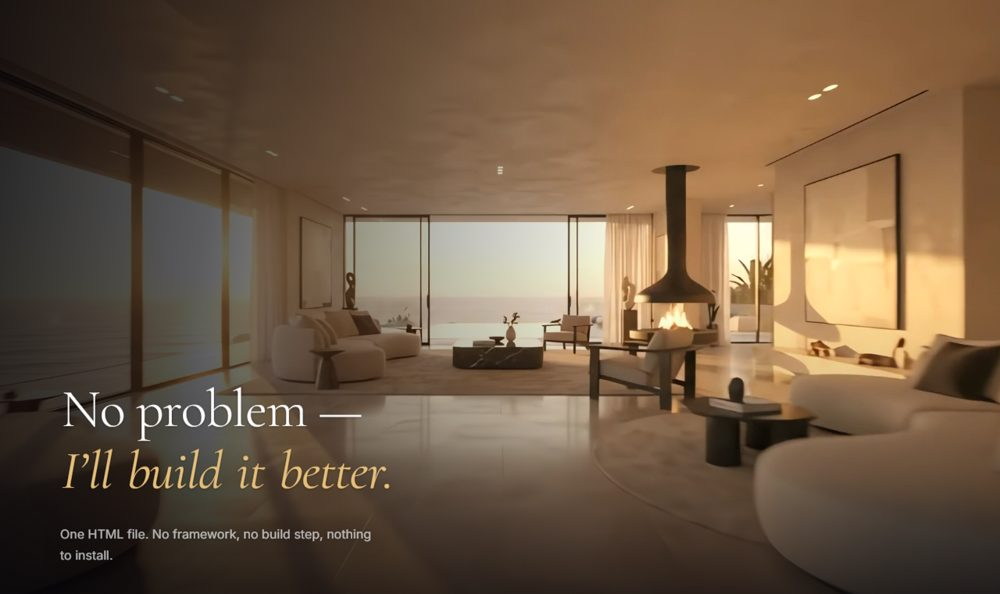

# Mirador

<!-- badges -->
[](https://github.com/YuraItDeveloper14/mirador/actions/workflows/check.yml) [](LICENSE) [](https://github.com/YuraItDeveloper14/mirador/commits)

<!-- preview -->
<p align="center">
  
</p>

A one-page site whose hero is a film you scrub with the scroll wheel. Scroll
position maps onto the video's `currentTime`, so the camera flies through the
house at exactly the speed you read — stop reading, and the flight stops.

**Live:** https://mirador-flythrough.vercel.app

No framework, no build step, no dependencies. One HTML file, two video files.

---

## The part that is not obvious

Setting `video.currentTime` from a scroll handler is four lines. Making it look
like anything other than a slideshow is the rest of this README.

### 1. The server must answer HTTP Range requests

This is the one that silently destroys the whole effect. Without range support
the browser reports `video.seekable.end(0) === 0` and refuses every seek — while
still reporting `readyState === 4` and painting the first frame. The page looks
alive and completely broken at the same time, and nothing appears in the console.

`python -m http.server` does not answer range requests. Neither do a few small
static hosts. `serve.py` in this repo is a ~60-line server that does; any real
host (Vercel, Netlify, nginx, GitHub Pages) already does.

Because that failure is invisible, the page also watches for it:

```js
if (film.currentTime > 0.08) { clearInterval(wake); return; }   // it moved — fine
if (seekable && wanted > 0.4 && ++misses > 10) fallbackToPlayback();
```

If the film was asked to move and never did, the page gives up on scrubbing and
just loops the video. Degraded, but never frozen.

### 2. Every frame is a keyframe

A normal H.264 file places keyframes a second or two apart. To show the frame at
7.45 s the decoder walks forward from the previous keyframe, which is fine for
playback and hopeless for scrubbing — you get visible lag on every seek.

Both files here are encoded all-intra (`-g 1 -keyint_min 1 -sc_threshold 0`), so
all 240 frames are independently decodable and every seek lands instantly. The
cost is size: roughly 3× the bitrate of an equivalent non-intra encode. For a
10-second clip that is a fair trade.

### 3. Never stack a seek on one already in flight

The first version lerped toward the scroll target and assigned `currentTime`
every frame. Seeks queue and cancel each other, so the film fell steadily behind
the scroll and only caught up when you stopped. The fix is to sample the eased
value only when the decoder is ready for it:

```js
shown += (wanted - shown) * 0.12;                 // ease, for weight
if (!film.seeking && Math.abs(film.currentTime - shown) > 0.02) {
  film.currentTime = shown;
}
```

Measured after the fix, at 0 / 25 / 50 / 75 / 100 % of scroll the film sits at
0.00 / 2.47 / 4.96 / 7.45 / 9.93 s against an expected span of 9.94 s.

### 4. The rAF loop sleeps

One `requestAnimationFrame` loop drives the video, the copy envelope and the
fade-out. It stops itself once the scroll has settled and the eased value has
caught up, and a `scroll` listener wakes it. No frames are burned while the page
sits still.

### 5. Two encodes, picked before the fetch starts

The choice happens in a tiny inline script directly under the `<video>` tag, so
the browser never begins loading the wrong file:

| file | size | for |
|---|---|---|
| `villa_flythrough.mp4` | 1920×1080, 12.4 MB | desktop |
| `villa_flythrough_light.mp4` | 1280×720, 5.8 MB | narrow viewports, `saveData`, 2G/3G |

The mobile cut keeps full resolution and drops bitrate instead. Resolution is
what reads as sharpness on a phone; bitrate is what costs the user money.

### 6. Grade and plate

The source clip was 1280×720 and soft. It was upscaled with Real-ESRGAN
(`realesr-animevideov3` — the photo-realistic model was ~310 s/frame on this
hardware, which is 20 hours for 240 frames), then scaled down to 1080p, which
also suppresses the model's artefacts. On top: a light grade
(`brightness +0.035, contrast 1.07, saturation 1.12`) and `deband` for the sky.

Two things were deliberately removed after testing them:

- **Film grain.** It reads as texture on a still and as mush on a moving plate,
  and it inflates an all-intra file badly.
- **A large soft `text-shadow` under the masked word reveal.** Each word rises
  out of an `overflow: hidden` box, which clips the glow into a visible
  rectangle behind every word. The mask is dropped once the words land:

```css
.w        { overflow: hidden; }    /* the mask they rise out of … */
.is-done .w { overflow: visible; } /* … gone once they land */
```

---

## Run it

```
python serve.py
```

Then open http://localhost:8125 — or just open `index.html` from disk, which
works too (`file://` seeks fine).

`serve.py` also binds to the LAN, so it prints a second address for testing on a
phone.

## Files

| | |
|---|---|
| `index.html` | everything — markup, design system, scroll engine |
| `serve.py` | static server with HTTP range support, for local preview |
| `vercel.json` | one header rule: year-long immutable cache on the `.mp4`s |
| `assets` | none — the poster is an inlined 2.6 KB base64 blur |

## Notes

The copy, the villa and the company are invented. It is a design and engineering
demo, not a real listing.

Type is Cormorant Garamond over Inter. Tested at 1440×900 and 390×844.
`prefers-reduced-motion` drops the parallax, the blur and the word stagger, and
snaps the scrub instead of easing it.
